# 🚀 Повний посібник зі встановлення ADBlock-Private-DNS (ADBlock-PD)

Цей посібник допоможе вам розгорнути, налаштувати та захистити ваш власний DNS-сервер **ADBlock-PD**.

---

## 🏗️ Процес розгортання (Deployment Flow)

```mermaid
flowchart LR
    classDef step fill:#0072ff,stroke:#00d4ff,stroke-width:2px,color:#fff,font-weight:bold,rx:10,ry:10;
    classDef config fill:#f0a500,stroke:#cf7500,stroke-width:2px,color:#fff,font-weight:bold,rx:10,ry:10;
    classDef ssl fill:#16c79a,stroke:#11999e,stroke-width:2px,color:#fff,font-weight:bold,rx:10,ry:10;
    classDef done fill:#e84545,stroke:#903749,stroke-width:2px,color:#fff,rx:10,ry:10;

    A["🐳 1. Запуск Docker-контейнера"]:::step
    B["🌐 2. Майстер початкового налаштування<br>(Web UI: порт 3000)"]:::step
    C["⚙️ 3. Налаштування Upstream-серверів<br>та Блок-листів"]:::config
    D["🔒 4. Встановлення SSL-сертифікатів<br>(Let's Encrypt / Custom)"]:::ssl
    E["🛡️ 5. Увімкнення DoH, DoT, DoQ"]:::ssl
    F["🎉 ADBlock-PD Готовий до роботи!"]:::done

    A --> B
    B --> C
    C --> D
    D --> E
    E --> F
```



---

## 1. Запуск контейнера (Docker)

Найкращий спосіб розгортання — використання Docker Compose.

1. Створіть робочу директорію:
   ```bash
   mkdir -p /opt/adblock-pd/{data,conf}
   cd /opt/adblock-pd
   ```

2. Створіть файл `docker-compose.yml`:
   ```yaml
   version: "3.8"
   services:
     adblock-pd:
       image: webyhomelab/adblock-pd:latest
       container_name: adblock-pd
       restart: always
       ports:
         - "53:53/tcp"
         - "53:53/udp"
         - "80:80/tcp"        # Веб-інтерфейс керування
         - "3000:3000/tcp"    # Майстер початкового налаштування
         - "443:443/tcp"      # DoH / HTTPS
         - "443:443/udp"      # HTTP/3
         - "853:853/tcp"      # DoT
         - "853:853/udp"      # DoQ
       volumes:
         - ./data:/opt/adblock-pd/data
         - ./conf:/opt/adblock-pd/conf
   ```

3. Запустіть контейнер:
   ```bash
   docker-compose up -d
   ```

---

## 2. Майстер початкового налаштування

Після успішного запуску контейнера, відкрийте браузер та перейдіть за адресою:
👉 `http://<IP_ВАШОГО_СЕРВЕРА>:3000`

1. **Інтерфейс керування (Admin Web Interface):** Виберіть порт `80` (або `8080`, якщо 80 вже зайнятий).
2. **DNS-сервер:** Залиште порт `53` на всіх інтерфейсах.
3. Створіть обліковий запис адміністратора (логін та надійний пароль).
4. Завершіть налаштування. Тепер панель буде доступна на порту, який ви обрали на першому кроці (наприклад, `http://<IP_ВАШОГО_СЕРВЕРА>`).

---

## 3. Базове налаштування DNS

Увійдіть до панелі керування та виконайте такі кроки:

1. Перейдіть до **Налаштування -> Налаштування DNS**.
2. У полі **Upstream DNS-сервери** вкажіть надійні зашифровані сервери (видаліть стандартні небезпечні):
   ```text
   https://security.cloudflare-dns.com/dns-query
   tls://dns.quad9.net
   ```
3. Перейдіть до **Фільтри -> Блок-листи DNS** і додайте необхідні списки (наприклад, AdAway, регіональні фільтри).

---

## 4. 🔒 Налаштування Шифрування (HTTPS, DoH, DoT, DoQ)

Щоб зробити ваш DNS-сервер по-справжньому приватним, необхідно налаштувати шифрування. Для цього потрібен дійсний домен та SSL-сертифікат.

### Отримання сертифіката (Let's Encrypt / Certbot)

Якщо у вас є домен (наприклад, `dns.yourdomain.com`), спрямуйте його A-запис на IP вашого сервера.

1. Встановіть Certbot на вашому хост-сервері:
   ```bash
   sudo apt update && sudo apt install certbot
   ```
2. Отримайте сертифікат (зупиніть ADBlock-PD на порті 80 на час отримання, якщо використовуєте standalone):
   ```bash
   sudo certbot certonly --standalone -d dns.yourdomain.com
   ```
   Ваші сертифікати будуть збережені у `/etc/letsencrypt/live/dns.yourdomain.com/`.

### Налаштування в ADBlock-PD

Оскільки ADBlock-PD працює в Docker від імені обмеженого користувача (`UID 10001`), він не має доступу до системної папки `/etc/letsencrypt/`. Є два шляхи:

#### Шлях А: Ручне вставлення (Рекомендовано для безпеки)
1. У панелі ADBlock-PD перейдіть до **Налаштування -> Шифрування**.
2. Поставте галочку **Увімкнути шифрування**.
3. Вкажіть **Ім'я сервера**: `dns.yourdomain.com`
4. Прокрутіть вниз до розділу **Сертифікати**.
5. На хост-сервері виведіть вміст сертифіката та ключа:
   ```bash
   sudo cat /etc/letsencrypt/live/dns.yourdomain.com/fullchain.pem
   sudo cat /etc/letsencrypt/live/dns.yourdomain.com/privkey.pem
   ```
6. Скопіюйте вміст `fullchain.pem` у перше поле (Сертифікат), а вміст `privkey.pem` — у друге поле (Приватний ключ).
7. Натисніть **Зберегти**. Статус має змінитися на "Дійсний".

#### Шлях Б: Прокидання томів (Для автооновлення)
Якщо ви хочете, щоб сертифікати оновлювалися автоматично, скопіюйте їх у папку `conf` проєкту і змініть власника:
```bash
sudo cp -r /etc/letsencrypt/live/dns.yourdomain.com /opt/adblock-pd/conf/certs
sudo chown -R 10001:10001 /opt/adblock-pd/conf/certs
```
У веб-інтерфейсі вкажіть шляхи:
- Сертифікат: `/opt/adblock-pd/conf/certs/fullchain.pem`
- Ключ: `/opt/adblock-pd/conf/certs/privkey.pem`

---

## 5. Перевірка працездатності

Тепер ви можете використовувати ваш захищений DNS-сервер на своїх пристроях!

*   **DoH (DNS-over-HTTPS):** `https://dns.yourdomain.com/dns-query`
*   **DoT (DNS-over-TLS):** `tls://dns.yourdomain.com`
*   **DoQ (DNS-over-QUIC):** `quic://dns.yourdomain.com`

*Насолоджуйтесь інтернетом без реклами та стеження! 🛡️*
