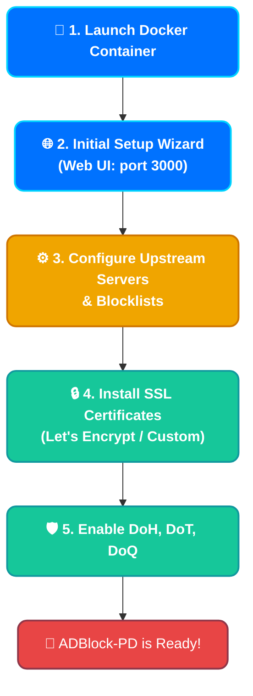

# 🚀 Complete Installation Guide for ADBlock-Private-DNS (ADBlock-PD)

This guide will help you deploy, configure, and secure your own **ADBlock-PD** DNS server.

---

## 🏗️ Deployment Flow



---

## 1. Launching the Container (Docker)

The recommended deployment method is using Docker Compose.

1. Create a working directory:
   ```bash
   mkdir -p /opt/adblock-pd/{data,conf}
   cd /opt/adblock-pd
   ```

2. Create a `docker-compose.yml` file:
   ```yaml
   version: "3.8"
   services:
     adblock-pd:
       image: webyhomelab/adblock-pd:latest
       container_name: adblock-pd
       restart: always
       ports:
         - "53:53/tcp"
         - "53:53/udp"
         - "80:80/tcp"        # Web Admin Interface
         - "3000:3000/tcp"    # Initial Setup Wizard
         - "443:443/tcp"      # DoH / HTTPS
         - "443:443/udp"      # HTTP/3
         - "853:853/tcp"      # DoT
         - "853:853/udp"      # DoQ
       volumes:
         - ./data:/opt/adblock-pd/data
         - ./conf:/opt/adblock-pd/conf
   ```

3. Start the container:
   ```bash
   docker-compose up -d
   ```

---

## 2. Initial Setup Wizard

Once the container is running, open your web browser and navigate to:
👉 `http://<YOUR_SERVER_IP>:3000`

1. **Admin Web Interface:** Select port `80` (or `8080` if 80 is occupied).
2. **DNS Server:** Leave port `53` on all interfaces.
3. Create an administrator account (username and strong password).
4. Complete the setup. The dashboard will now be accessible on the port you chose in step 1 (e.g., `http://<YOUR_SERVER_IP>`).

---

## 3. Basic DNS Configuration

Log in to the dashboard and perform the following steps:

1. Go to **Settings -> DNS Settings**.
2. In the **Upstream DNS servers** field, specify reliable encrypted servers (remove the default insecure ones):
   ```text
   https://security.cloudflare-dns.com/dns-query
   tls://dns.quad9.net
   ```
3. Go to **Filters -> DNS blocklists** and add the necessary lists (e.g., AdAway, regional filters).

---

## 4. 🔒 Encryption Setup (HTTPS, DoH, DoT, DoQ)

To make your DNS server truly private, you must configure encryption. This requires a valid domain and an SSL certificate.

### Obtaining a Certificate (Let's Encrypt / Certbot)

If you have a domain (e.g., `dns.yourdomain.com`), point its A record to your server's IP.

1. Install Certbot on your host server:
   ```bash
   sudo apt update && sudo apt install certbot
   ```
2. Obtain the certificate (temporarily stop ADBlock-PD on port 80 if using standalone mode):
   ```bash
   sudo certbot certonly --standalone -d dns.yourdomain.com
   ```
   Your certificates will be saved in `/etc/letsencrypt/live/dns.yourdomain.com/`.

### Configuring ADBlock-PD

Since ADBlock-PD runs in Docker under an unprivileged user (`UID 10001`), it does not have access to the system directory `/etc/letsencrypt/`. There are two ways to apply the certificates:

#### Method A: Manual Input (Recommended for Security)
1. In the ADBlock-PD dashboard, go to **Settings -> Encryption**.
2. Check **Enable Encryption**.
3. Enter your **Server name**: `dns.yourdomain.com`
4. Scroll down to the **Certificates** section.
5. On your host server, output the contents of the certificate and key:
   ```bash
   sudo cat /etc/letsencrypt/live/dns.yourdomain.com/fullchain.pem
   sudo cat /etc/letsencrypt/live/dns.yourdomain.com/privkey.pem
   ```
6. Copy the contents of `fullchain.pem` into the first box (Certificate) and `privkey.pem` into the second box (Private key).
7. Click **Save**. The status should change to "Valid certificate".

#### Method B: Volume Mounts (For Auto-Renewal)
If you want certificates to renew automatically, copy them into the project's `conf` folder and change the ownership:
```bash
sudo cp -r /etc/letsencrypt/live/dns.yourdomain.com /opt/adblock-pd/conf/certs
sudo chown -R 10001:10001 /opt/adblock-pd/conf/certs
```
In the web interface, specify the file paths:
- Certificate path: `/opt/adblock-pd/conf/certs/fullchain.pem`
- Private key path: `/opt/adblock-pd/conf/certs/privkey.pem`

---

## 5. Verification

You can now use your secure DNS server on your devices!

*   **DoH (DNS-over-HTTPS):** `https://dns.yourdomain.com/dns-query`
*   **DoT (DNS-over-TLS):** `tls://dns.yourdomain.com`
*   **DoQ (DNS-over-QUIC):** `quic://dns.yourdomain.com`

*Enjoy an ad-free, tracking-free internet! 🛡️*
