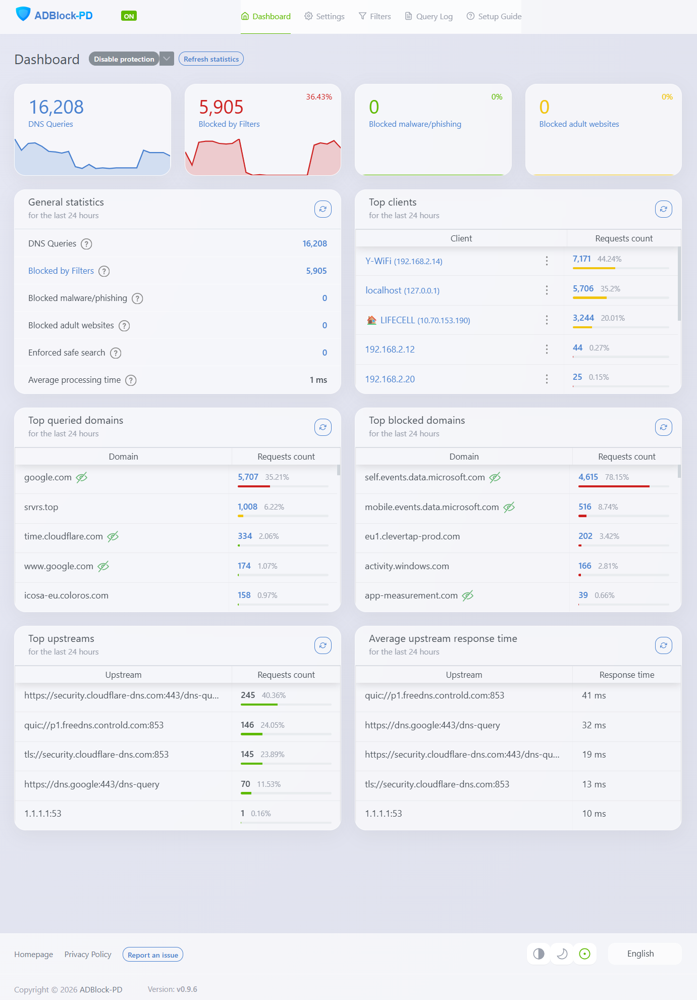
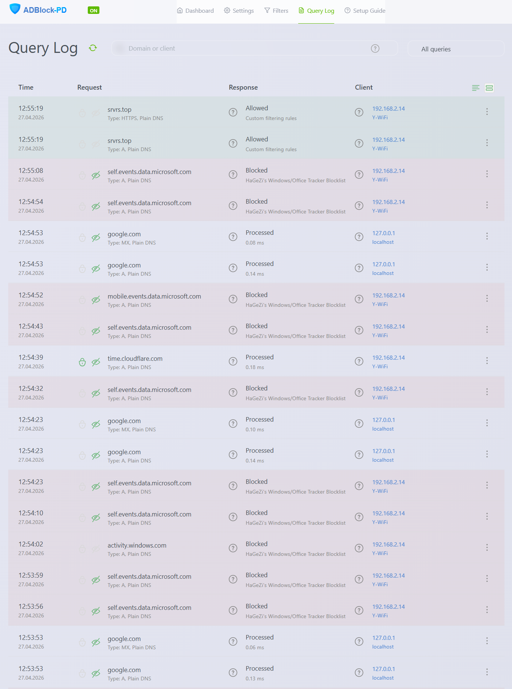
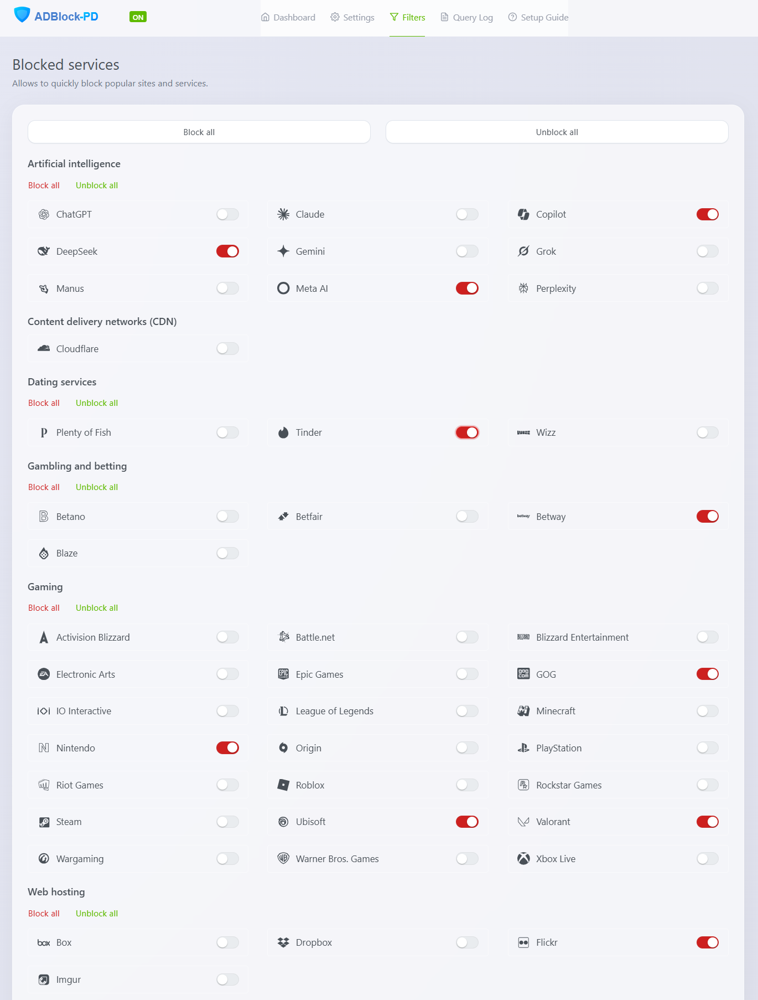
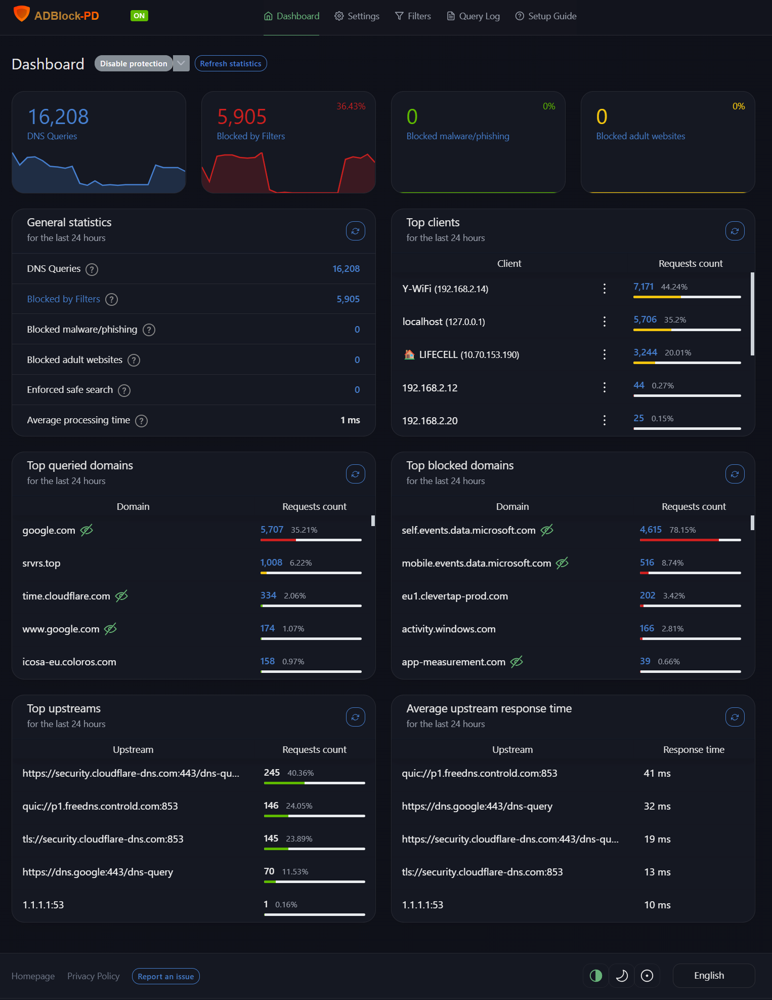
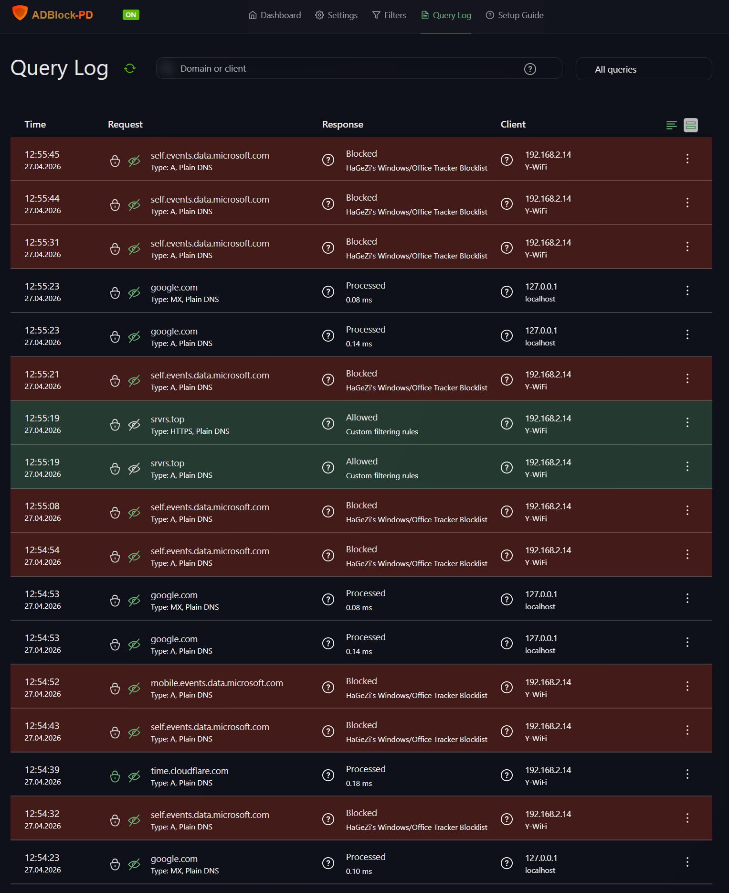
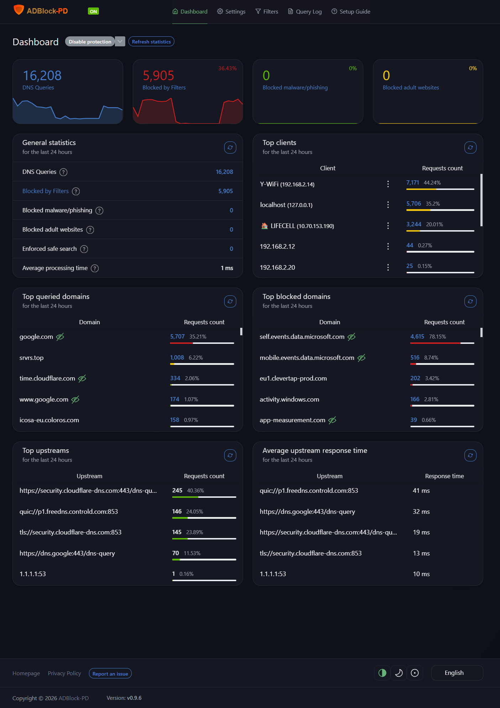
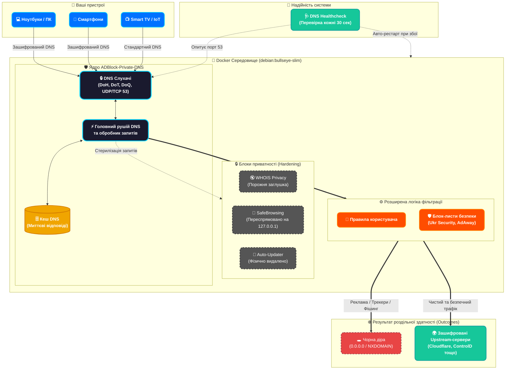

<p align="center">
  <a href="README_ENG.md">
    
  </a>
  <a href="README.md">
    
  </a>
</p>

<br>

# 🛡️ ADBlock-Private-DNS (ADBlock-PD)

<p align="center">
  <picture>
    <source media="(prefers-color-scheme: dark)" srcset="https://raw.githubusercontent.com/weby-homelab/adblock-pd/master/logo-dark.svg">
    <source media="(prefers-color-scheme: light)" srcset="https://raw.githubusercontent.com/weby-homelab/adblock-pd/master/logo-light.svg">
    
  </picture>
</p>

<p align="center">
  <em>Ультимативний, жорстко захищений форк популярного DNS-сервера для тих, хто вимагає абсолютної приватності.</em>
</p>

<p align="center">
  <a href="https://hub.docker.com/r/webyhomelab/adblock-pd"></a>
  <a href="https://github.com/weby-homelab/adblock-pd/releases/latest"></a>
  <a href="https://github.com/weby-homelab/adblock-pd/blob/master/LICENSE.txt"></a>
</p>

---

## 📸 Інтерфейс (Bento UI / Glassmorphism)

<p align="center">
  
  
  
</p>
<p align="center">
  
  
  
</p>

## 🎯 Що це таке?
**ADBlock-Private-DNS (ADBlock-PD)** — це власна розробка на базі відомого DNS-сервера AdGuard Home (версії 0.107.74). Проєкт створений командою **Weby Homelab** з єдиною метою: **повністю усунути будь-які зв'язки з інфраструктурою початкових розробників та будь-якою іншою зовнішньою мережею**. Ми взяли потужний рушій фільтрації та провели його повну "стерилізацію". 

Ваш DNS-сервер повинен належати лише вам. Ніякого збору даних, жодних прихованих запитів, жодного завантаження стороннього коду без вашого відома.

### 🏗️ Архітектура (Architecture)



## ✨ Ключові відмінності та посилення безпеки

### 🚀 Видалення модуля оновлень (Захист від віддаленого виконання коду)
Оригінальний модуль `internal/updater` фізично видалено з вихідного коду. Сервер **ніколи** не буде звертатися до сторонніх серверів для перевірки оновлень. Це ліквідує потенційний шлях віддаленого виконання коду через підміну файлів оновлень або злам інфраструктури розробника.

### 🔒 Захист DNS та відсутність прихованих підключень
- **Безпечний перегляд та Батьківський контроль:** В оригіналі ці функції надсилають часткові дані ваших запитів на зовнішні сервери. В **ADBlock-PD** ці адреси жорстко стерті, а запити перенаправляються на локальну адресу `127.0.0.1`. Функції повністю ізольовані.
- **Конфіденційність WHOIS:** Вбудований інструмент запитів WHOIS замінено на порожню "заглушку". IP-адреси пристроїв у вашій мережі більше не передаються зовнішнім сервірам.

### 🔇 Відсутність телеметрії та новий дизайн
Усі посилання у веб-інтерфейсі, що вели на трекери, системи аналітики або зовнішню документацію, замінено на нейтральні заглушки. Проєкт отримав новий адаптивний векторний логотип та повністю незалежний зовнішній вигляд.

### 🔄 Архітектура самовідновлення
Контейнер оснащено вбудованою перевіркою стану (`HEALTHCHECK`) на базі утиліти `host`. Система кожні 30 секунд перевіряє життєздатність DNS-служби (`127.0.0.1:53`). Якщо служба "зависає", Docker автоматично її перезапускає, гарантуючи стабільний інтернет у вашій мережі.

### 🐧 Легка та безпечна основа
Фінальний образ Docker базується на мінімалістичній операційній системі `debian:bullseye-slim`. Служба запускається від імені звичайного користувача (`UID 10001`), з доданим параметром `--no-permcheck` для безпечного запуску в ізольованому середовищі Docker. За замовчуванням встановлено київський час (`Europe/Kyiv`).

---

## 🚀 Запуск та Налаштування

Для правильного розгортання проєкту (запуск Docker, проходження майстра налаштування та встановлення SSL-сертифікатів для DoH/DoT/DoQ), будь ласка, ознайомтеся з нашим детальним посібником:

📖 **[Повний посібник зі встановлення (INSTRUCTIONS_INSTALL.md)](INSTRUCTIONS_INSTALL.md)**

---

## 🛠 Збирання з вихідного коду

Якщо ви хочете зібрати проєкт самостійно, вам знадобиться Docker (використовується багатоетапне збирання). 

```bash
git clone https://github.com/weby-homelab/adblock-pd.git
cd adblock-pd
docker build -t adblock-pd:local .
```

---

## 📜 Ліцензія та Відмова від відповідальності

Цей проєкт розповсюджується під ліцензією **GNU General Public License v3.0 (GPL-3.0)**. 
Проєкт надається "ЯК Є". Команда Weby Homelab не несе відповідальності за будь-які збої в роботі мережі, втрату даних або інші наслідки використання цього програмного забезпечення.

---

<br>
<p align="center">
  Built in Ukraine under air raid sirens &amp; blackouts ⚡<br>
  &copy; 2026 Weby Homelab
</p>
